<br/>

<div align="left">

```
ACCESS GRANTED ─────────────────────────────────────────── CLEARANCE: LEVEL 5
```

</div>

---

<table width="100%">
<tr>
<td width="55%" valign="top">

```typescript
const operator = {
  name     : "Dhruv Juneja",
  base     : "India 🇮🇳",
  mission  : "AI × Security — defend the future",
  building : [
    "Scalable backend systems",
    "AI-driven threat detection",
    "Security-first APIs",
  ],
  seeking  : "Open to Contribute & Collaborate",
}
```

</td>
<td width="45%" valign="top" align="right">

```
CREDENTIALS ──────────────────────
☁  AWS Cloud Practitioner
🤖  SAP Generative AI Developer
📊  Azure Data Fundamentals
──────────────────────────────────
```

</td>
</tr>
</table>

---

```
SYSTEM CAPABILITIES ────────────────────────────────────────────────────────────
```

```
  PYTHON        ━━━━━━━━━━━━━━━━━━━━░░░░   90%   primary language
  FASTAPI       ━━━━━━━━━━━━━━━━━━░░░░░░   85%   api backbone
  NODE.JS       ━━━━━━━━━━━━━━━━░░░░░░░░   78%   runtime
  POSTGRESQL    ━━━━━━━━━━━━━━░░░░░░░░░░   72%   relational
  MONGODB       ━━━━━━━━━━━━░░░░░░░░░░░░   65%   document store
  DOCKER        ━━━━━━━━━━━━░░░░░░░░░░░░   63%   containerization
  AWS           ━━━━━━━━━░░░░░░░░░░░░░░░   55%   cloud
  REACT         ━━━━━━━━░░░░░░░░░░░░░░░░   50%   frontend
```

---

```
ACTIVE OBJECTIVES ──────────────────────────────────────────────────────────────
```

```
  ▸  AI-Driven Intrusion Detection System    ████████████████░░░░░░   72%
  ▸  Distributed Backend Architecture        █████████████░░░░░░░░░   60%
  ▸  Zero-Trust API Security Layer           ██████████░░░░░░░░░░░░   48%
  ▸  MLOps Pipeline Automation               ████████░░░░░░░░░░░░░░   40%
```

---

```
CONTRIBUTION TIMELINE ──────────────────────────────────────────────────────────
```

[](https://github.com/dhruvjunejalk)

---

```
OPEN CHANNELS ──────────────────────────────────────────────────────────────────
```

<div align="left">

[](https://dhruvjuneja.vercel.app)
&nbsp;
[](https://linkedin.com/in/dhruvjuneja100)
&nbsp;
[](https://leetcode.com/u/dhruvjunejalk/)
&nbsp;
[](mailto:dhruvjunejalk@gmail.com)

</div>

<br/>

```
─────────────────────────────────── END OF FILE ────────────────────────────────
```
